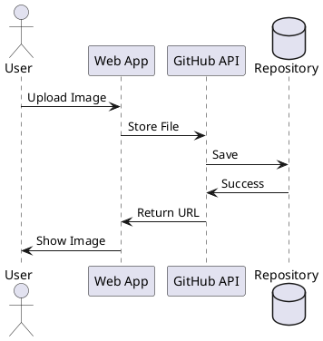
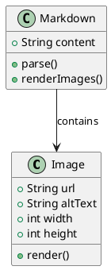

# Adding Images to Documentation

This guide shows you how to add images to your markdown documentation.

## Method 1: External URLs

You can use any publicly accessible image URL. Here are some examples:

### Using Unsplash (Free Stock Photos)


### Using GitHub Assets

You can also use images from GitHub repositories or GitHub user content.

## Method 2: GitHub-Hosted Images

Store images in your repository under `public/images/`:

```markdown

```

**Steps to add:**
1. Create `public/images/` folder in your repo
2. Upload your image files
3. Reference them using `/images/filename.png`
4. Commit and push to GitHub

## Method 3: PlantUML Diagrams (Working!)

For UML diagrams, use PlantUML code blocks:



## Method 4: Simple Diagrams



## Best Practices

**Pros:**
- Use descriptive alt text for accessibility
- Optimize images for web (compress them)
- Use appropriate image formats (PNG for diagrams, JPG for photos)
- Store images in a dedicated folder
- Use CDN or GitHub for hosting

**Cons to Avoid:**
- Don't use very large images (slow loading)
- Don't use copyrighted images without permission
- Don't forget alt text
- Don't use absolute local paths
- Avoid hotlinking from sites that don't allow it

## Image Sizing

You can control image size using HTML in markdown:

```html

```


## Quick Upload Method

**Using GitHub Issues:**
1. Go to any GitHub issue in your repo
2. Drag and drop your image into the comment box
3. GitHub will upload it and give you a URL like:
   `https://user-images.githubusercontent.com/...`
4. Copy that URL and use it in your markdown
5. This is the fastest way to add images!
