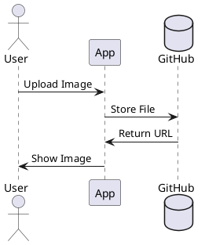

# Adding Images to Documentation

This guide shows you how to add images to your markdown documentation.

## Method 1: External URLs

You can use any publicly accessible image URL:


## Method 2: GitHub-Hosted Images

Store images in your repository under `public/images/`:

```markdown

```

## Method 3: Mermaid Diagrams

For technical diagrams, you can use Mermaid (coming soon):


## Method 4: PlantUML Diagrams

For UML diagrams, use PlantUML (already supported):



## Best Practices

**Pros:**
- Use descriptive alt text for accessibility
- Optimize images for web (compress them)
- Use appropriate image formats (PNG for diagrams, JPG for photos)
- Store images in a dedicated folder

**Cons to Avoid:**
- Don't use very large images (slow loading)
- Don't use copyrighted images without permission
- Don't forget alt text
- Don't use absolute local paths

## Image Sizing

You can control image size using HTML in markdown:

```html

```


