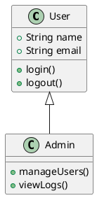
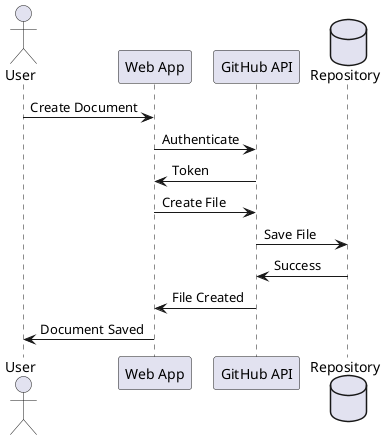

# PlantUML Diagram Support

This documentation viewer now supports PlantUML diagrams! You can create diagrams using code blocks with the `plantuml` or `uml` language identifier.

## Example: Simple Class Diagram



## Example: Sequence Diagram



## Example: Component Diagram

```uml
@startuml
package "Frontend" {
  [React App]
  [DocumentViewer]
  [PlantUML Component]
}

package "Backend" {
  [GitHub API]
  [PlantUML Server]
}

database "GitHub Repository" {
  [Markdown Files]
}

[React App] --> [DocumentViewer]
[DocumentViewer] --> [PlantUML Component]
[PlantUML Component] --> [PlantUML Server]
[React App] --> [GitHub API]
[GitHub API] --> [Markdown Files]
@enduml
```

## How to Use

1. Create a code block with ` ```plantuml ` or ` ```uml `
2. Write your PlantUML code inside
3. The diagram will be automatically rendered!

## Supported Diagram Types

- Class Diagrams
- Sequence Diagrams
- Use Case Diagrams
- Activity Diagrams
- Component Diagrams
- State Diagrams
- Object Diagrams
- Deployment Diagrams
- Timing Diagrams
- And more!
